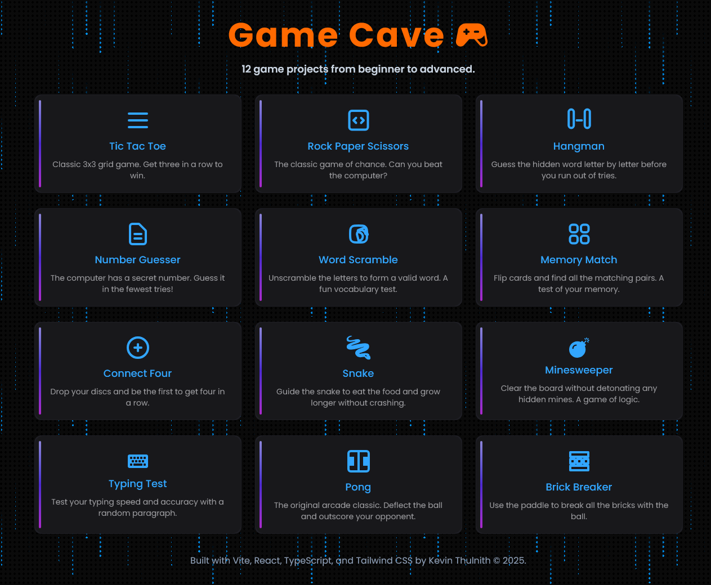

[](#)
[](#)
[](#)
[](#)
[](#)
[](#)
[](#)
[](#)

# Game Cave 🎮

A collection of classic game projects developed with **Vite | React | Tailwind CSS and TypeScript** with **Server-Side Rendering (SSR)**. 🚀 **[Live Demo on Vercel](https://game-cave-mu.vercel.app/)** | 📱 **Mobile Friendly** | ⚡ **Lightning Fast** | 🐳 **Docker Ready** | 🔄 **SSR Enabled**



---

## 🎯 Featured Games

<div align="center">

| 🧱 **Classic Arcade** | 🧩 **Strategy & Logic** |   🎲 **Casual Fun**    |
| :-------------------: | :---------------------: | :--------------------: |
|   🧱 Brick Breaker    |     🔴 Connect Four     |   🎯 Number Guesser    |
|       🐍 Snake        |     🎯 Tic Tac Toe      | 🪨 Rock Paper Scissors |
|        🏓 Pong        |     💣 Minesweeper      |    🔤 Word Scramble    |
|                       |     🧠 Memory Match     |     ⚡ Typing Test     |
|                       |       🎪 Hangman        |                        |

</div>

### 🌟 Game Highlights

- **🧱 Brick Breaker** - Classic arcade action with paddle and ball physics
- **🐍 Snake** - Navigate the snake to collect food and grow longer
- **🔴 Connect Four** - Strategic gameplay to connect four pieces in a row
- **💣 Minesweeper** - Clear the minefield using logic and deduction
- **🧠 Memory Match** - Test your memory with card matching gameplay
- **🏓 Pong** - The original tennis-style arcade game
- **🎯 Tic Tac Toe** - Classic 3x3 grid strategy game
- **🎪 Hangman** - Guess the word before the drawing is complete
- **🎯 Number Guesser** - Challenge your intuition with number guessing
- **🪨 Rock Paper Scissors** - The timeless hand game
- **⚡ Typing Test** - Improve your typing speed and accuracy
- **🔤 Word Scramble** - Unscramble letters to form words

---

## ✨ Key Features

- 🎮 **12 Classic Games** - A diverse collection of timeless games
- 📱 **Responsive Design** - Perfect on desktop, tablet, and mobile
- ⚡ **Lightning Fast** - Built with Vite for optimal performance
- 🎨 **Modern UI** - Clean, intuitive interface with TailwindCSS
- 🔧 **Type Safe** - Written in TypeScript for reliability
- 🔄 **Server-Side Rendering (SSR)** - Faster initial page loads and better SEO
- 🐳 **Docker + Nginx Architecture** - Production-ready containerized deployment with reverse proxy
- 🌐 **Multi-Platform Deploy** - Vercel, Docker, Kubernetes, or any cloud platform
- 🎯 **PWA Ready** - Can be installed as a Progressive Web App
- 🔄 **State Management** - Smooth game state handling
- 🎵 **Sound Effects** - Immersive audio feedback (coming soon)
- 🏆 **Score Tracking** - Keep track of your best performances

---

## 🚀 Quick Start

Choose your preferred setup method:

### 🏃‍♂️ **Local Development** (Recommended for development)

- Standard npm setup with hot reload
- Perfect for development and customization

### 🐳 **Docker Deployment** (Recommended for consistency)

- Containerized environment
- Works identically across all platforms
- Great for teams and production

### 🌐 **Cloud Deployment** (Recommended for production)

- One-click deploy to Vercel
- Instant global CDN distribution

---

### 📦 Installation

1. **Clone the repository:**

   ```bash
   git clone https://github.com/kevinThulnith/game-cave.git
   ```

2. **Navigate to the frontend directory:**

   ```bash
   cd javascript-games/frontend
   ```

3. **Install dependencies:**

   ```bash
   npm i
   ```

4. **Set up environment variables (optional):**

   Create a `.env` file in the frontend directory:

   ```bash
   # In the frontend directory
   touch .env
   ```

   Add the following environment variables to your `.env` file:

   ```env
   # Optional: Gemini API Key for future AI features
   GEMINI_API_KEY=your_gemini_api_key_here
   ```

   > **Note:** The GEMINI_API_KEY is currently set up for potential future AI-powered features but is not required for basic gameplay. You can obtain a free API key from [Google AI Studio](https://aistudio.google.com/app/apikey) if you plan to extend the games with AI functionality.

 <br>

### 🎮 Running the Games

#### Development Mode

```bash
npm run dev
```

- Starts the development server at `http://localhost:5173/`\_

#### Production Build

```bash
npm run build
```

- Creates an optimized production build with SSR support\_

#### Server-Side Rendering (SSR) Mode

```bash
npm run serve
```

- Runs the production build with SSR for better SEO and faster initial loads\_

#### Preview Build

```bash
npm run preview
```

- Preview the production build locally\_

#### Network Access

```bash
npm run host
```

_Run on your local network for testing on multiple devices_

---

## 🌐 Deployment

### Deploy to Vercel

The easiest way to deploy your Game Cave is using [Vercel](https://vercel.com/):

1. **One-Click Deploy:**

   [](https://vercel.com/new/clone?repository-url=https://github.com/kevinThulnith/game-cave)

2. **Manual Deployment:**

   ```bash
   # Install Vercel CLI
   npm i -g vercel

   # Deploy from the frontend directory
   cd frontend
   vercel
   ```

3. **GitHub Integration:**
   - Connect your repository to Vercel
   - Automatic deployments on every push to main branch
   - Preview deployments for pull requests

### Build Configuration

For Vercel deployment, make sure your build settings are:

- **Build Command:** `npm run build`
- **Output Directory:** `dist`
- **Install Command:** `npm install`
- **Root Directory:** `frontend`

### Environment Variables

For basic gameplay, no environment variables are required - the games run entirely on the client side! However, if you want to set up the project for future AI-powered features:

1. **Create a `.env` file in the frontend directory:**

   ```bash
   cd frontend
   touch .env  # On Windows: type nul > .env
   ```

2. **Add the following variables:**

   ```env
   # Optional: For future AI-powered game features
   GEMINI_API_KEY=your_gemini_api_key_here
   ```

3. **Get your Gemini API Key (optional):**
   - Visit [Google AI Studio](https://aistudio.google.com/app/apikey)
   - Create a new API key
   - Replace `your_gemini_api_key_here` with your actual key

> **Important:** Never commit your `.env` file to version control. The `.env` file is already included in `.gitignore` for your security.

---

## 🐳 Docker + Nginx Architecture

Game Cave features a sophisticated Docker setup with **Nginx reverse proxy** and **Node.js SSR server** for optimal performance and production-ready deployment. This architecture provides:

- **🚀 Lightning-fast static file serving** via Nginx
- **⚡ Server-Side Rendering (SSR)** for better SEO and initial load times
- **📦 Multi-stage Docker builds** for minimal production images
- **🔄 Reverse proxy setup** for seamless request handling
- **🏥 Health checks** and monitoring capabilities

### 🏗️ Architecture Overview

```
┌─────────────────┐    ┌─────────────────┐    ┌─────────────────┐
│   User Request  │ -> │  Nginx (5173)   │ -> │ Node.js (3000)  │
│                 │    │  Reverse Proxy  │    │   SSR Server    │
└─────────────────┘    └─────────────────┘    └─────────────────┘
                              │
                              ▼
                    ┌─────────────────┐
                    │  Static Assets  │
                    │  (Direct Serve) │
                    └─────────────────┘
```

### 📋 Prerequisites

Ensure Docker is installed on your system:

```bash
# Check if Docker is installed
docker --version

# Check if Docker Compose is available (optional)
docker compose version
```

> **Need Docker?** Download from [docker.com](https://www.docker.com/products/docker-desktop) - Available for Windows, macOS, and Linux

### 🚀 Quick Start with Docker

#### Method 1: Production Build & Run (Recommended)

1. **Navigate to the frontend directory:**

   ```bash
   cd frontend
   ```

2. **Build the production Docker image:**

   ```bash
   # Multi-stage production build with Nginx + Node.js SSR
   docker build -t game-cave:latest .
   ```

3. **Run the production container:**

   ```bash
   # Run with Nginx reverse proxy + SSR server
   docker run -p 5173:5173 --name game-cave-prod game-cave:latest

   # Run in detached mode (background)
   docker run -d -p 5173:5173 --name game-cave-prod game-cave:latest
   ```

4. **Verify the deployment:**

   ```bash
   # Check container status
   docker ps

   # Check application health
   curl http://localhost:5173/health

   # View container logs
   docker logs game-cave-prod
   ```

5. **Access your games:**
   - 🌐 **Local:** http://localhost:5173
   - 📱 **Network:** http://your-ip-address:5173
   - 🏥 **Health Check:** http://localhost:5173/health

#### Method 2: Docker Compose (Advanced)

Create a `docker-compose.yml` file in the frontend directory:

```yaml
# docker-compose.yml
version: "3.8"
services:
  game-cave:
    build: .
    ports:
      - "5173:5173"
    container_name: game-cave-app
    restart: unless-stopped
    healthcheck:
      test: ["CMD", "wget", "-q", "--spider", "http://localhost:5173/health"]
      interval: 30s
      timeout: 10s
      retries: 3
      start_period: 40s
```

```bash
# Navigate to frontend directory
cd frontend

# Start the application with Docker Compose
docker compose up -d

# View logs
docker compose logs -f game-cave

# Stop the application
docker compose down
```

### 🛠️ Docker Architecture Details

#### Multi-Stage Build Process

The Dockerfile uses a sophisticated **3-stage build process**:

1. **Builder Stage (Node.js):**

   - Installs dependencies and builds the application
   - Creates optimized production bundles
   - Generates SSR-ready assets

2. **Node Stage (Runtime):**

   - Copies only essential runtime files
   - Minimal Node.js environment for SSR server
   - Production-optimized package installation

3. **Production Stage (Nginx + Node.js):**
   - Nginx as reverse proxy on port 5173
   - Node.js SSR server running on port 3000
   - Optimized static file serving with caching
   - Health check endpoints

#### Container Architecture

- **Frontend (Port 5173):** Nginx reverse proxy handles all incoming requests
- **Backend (Port 3000):** Node.js SSR server generates dynamic content
- **Static Assets:** Served directly by Nginx with optimal caching
- **Health Monitoring:** Built-in health checks at `/health`

### 🛠️ Docker Commands Cheat Sheet

| Command                                    | Description              |
| ------------------------------------------ | ------------------------ |
| `docker build -t game-cave:latest .`       | Build production image   |
| `docker run -p 5173:5173 game-cave:latest` | Run production container |
| `docker ps`                                | List running containers  |
| `docker logs game-cave-prod`               | View container logs      |
| `docker exec -it game-cave-prod sh`        | Access container shell   |
| `docker stop game-cave-prod`               | Stop container           |
| `docker rm game-cave-prod`                 | Remove container         |
| `docker rmi game-cave:latest`              | Remove image             |
| `curl localhost:5173/health`               | Check application health |

### 🔧 Advanced Configuration

#### Custom Port Mapping

```bash
# Run on different ports
docker run -p 8080:5173 --name game-cave-custom game-cave:latest

# Multiple instances
docker run -p 8080:5173 --name game-cave-1 game-cave:latest
docker run -p 8081:5173 --name game-cave-2 game-cave:latest
```

#### Environment Variables & Nginx Tuning

```bash
# Run with custom environment variables
docker run -p 5173:5173 \
  -e NODE_ENV=production \
  -e PORT=3000 \
  --name game-cave-prod \
  game-cave:latest
```

#### Volume Mounting for Logs

```bash
# Mount logs for monitoring
docker run -p 5173:5173 \
  -v $(pwd)/logs:/var/log/nginx \
  --name game-cave-prod \
  game-cave:latest
```

### 🌐 Network Access & Performance

#### Mobile Testing & Network Access

```bash
# Run on all interfaces for network access
docker run -p 0.0.0.0:5173:5173 --name game-cave-prod game-cave:latest

# Find your IP address for mobile testing
# Windows PowerShell:
ipconfig | findstr IPv4
# macOS/Linux:
ifconfig | grep inet
```

Now test on mobile devices using `http://your-ip:5173`

#### Performance Features

- **⚡ Nginx Static File Serving:** Assets served directly with 1-year cache headers
- **�️ Gzip Compression:** Enabled for all text-based files
- **🔄 Reverse Proxy:** Efficient request routing to SSR server
- **📱 Mobile Optimized:** Responsive design works on all devices
- **🏥 Health Checks:** Built-in monitoring at `/health` endpoint

### �🐛 Troubleshooting

#### Common Issues & Solutions

| Issue                     | Solution                                                       |
| ------------------------- | -------------------------------------------------------------- |
| Port 5173 already in use  | Use different port: `-p 8080:5173`                             |
| Permission denied         | Check Docker Desktop (Windows) or use `sudo` (Linux/macOS)     |
| Container fails to start  | Check logs: `docker logs game-cave-prod`                       |
| Health check failing      | Verify: `curl http://localhost:5173/health`                    |
| Nginx errors              | Check Nginx logs: `docker exec game-cave-prod cat /dev/stderr` |
| SSR server not responding | Verify Node.js process: `docker exec game-cave-prod ps aux`    |

#### Detailed Troubleshooting

```bash
# Check container health
docker inspect game-cave-prod | grep -A 5 Health

# Access container for debugging
docker exec -it game-cave-prod sh

# Inside container - check processes
ps aux

# Check port bindings
netstat -tlnp

# Test Nginx configuration
nginx -t

# Test Node.js server directly
curl http://127.0.0.1:3000
```

#### Clean Slate Reset

```bash
# Stop and remove all Game Cave containers
docker stop $(docker ps -q --filter ancestor=game-cave:latest)
docker rm $(docker ps -aq --filter ancestor=game-cave:latest)

# Remove all Game Cave images
docker rmi $(docker images game-cave -q)

# Clean up unused Docker resources
docker system prune -af

# Rebuild from scratch
docker build -t game-cave:latest .
```

### 🚢 Production Deployment

#### Container Registry Deployment

```bash
# Tag your image for deployment
docker tag game-cave:latest yourusername/game-cave:latest

# Push to Docker Hub
docker push yourusername/game-cave:latest

# Deploy on any server
docker run -d -p 80:5173 --restart unless-stopped yourusername/game-cave:latest
```

#### Cloud Deployment Options

- **🌊 DigitalOcean App Platform** - Direct Docker deployment with auto-scaling
- **☁️ AWS ECS/Fargate** - Managed container orchestration with load balancing
- **🔵 Azure Container Instances** - Serverless containers with quick scaling
- **🌐 Google Cloud Run** - Pay-per-use container platform with auto-scaling
- **🚀 Railway** - Simple container deployment with automatic HTTPS
- **⚡ Fly.io** - Global edge deployment for containers

#### Kubernetes Deployment

```yaml
# k8s-deployment.yaml
apiVersion: apps/v1
kind: Deployment
metadata:
  name: game-cave
spec:
  replicas: 3
  selector:
    matchLabels:
      app: game-cave
  template:
    metadata:
      labels:
        app: game-cave
    spec:
      containers:
        - name: game-cave
          image: yourusername/game-cave:latest
          ports:
            - containerPort: 5173
          livenessProbe:
            httpGet:
              path: /health
              port: 5173
            initialDelaySeconds: 30
            periodSeconds: 10
---
apiVersion: v1
kind: Service
metadata:
  name: game-cave-service
spec:
  selector:
    app: game-cave
  ports:
    - port: 80
      targetPort: 5173
  type: LoadBalancer
```

### 📊 Container Monitoring & Performance

#### Resource Monitoring

```bash
# Monitor container resources in real-time
docker stats game-cave-prod

# Check memory usage
docker exec game-cave-prod free -h

# Check disk usage
docker exec game-cave-prod df -h

# Monitor network connections
docker exec game-cave-prod netstat -tulpn
```

#### Performance Metrics

```bash
# Test response times
curl -w "@curl-format.txt" -o /dev/null -s http://localhost:5173/

# curl-format.txt content:
#     time_namelookup:  %{time_namelookup}\n
#        time_connect:  %{time_connect}\n
#     time_appconnect:  %{time_appconnect}\n
#    time_pretransfer:  %{time_pretransfer}\n
#       time_redirect:  %{time_redirect}\n
#  time_starttransfer:  %{time_starttransfer}\n
#                     ----------\n
#          time_total:  %{time_total}\n

# Load testing with Apache Bench
ab -n 1000 -c 10 http://localhost:5173/

# Health check monitoring
watch -n 5 'curl -s http://localhost:5173/health'
```

### 🎯 Why Docker + Nginx for Game Cave?

#### Performance Benefits

- ✅ **Static Asset Optimization** - Nginx serves files 10x faster than Node.js
- ✅ **Concurrent Request Handling** - Nginx handles thousands of connections efficiently
- ✅ **Intelligent Caching** - 1-year cache headers for assets, dynamic content for pages
- ✅ **Gzip Compression** - Reduces bandwidth usage by up to 70%

#### Deployment Benefits

- ✅ **Production Ready** - Battle-tested Nginx + Node.js architecture
- ✅ **Scalable Architecture** - Easy to scale horizontally behind load balancers
- ✅ **Container Portability** - Same environment from dev to production
- ✅ **Health Monitoring** - Built-in health checks for container orchestration
- ✅ **Resource Efficiency** - Minimal container size with multi-stage builds

#### Developer Experience

- ✅ **One Command Deploy** - `docker run` and you're live
- ✅ **Consistent Environment** - No "works on my machine" issues
- ✅ **Easy Cleanup** - Remove everything with one command
- ✅ **Development Parity** - Same stack in dev and production

---

## 🛠️ Tech Stack

### Frontend Technologies

- **⚛️ React 19** - Modern UI library with hooks and functional components
- **📘 TypeScript** - Type-safe JavaScript for better development experience
- **⚡ Vite** - Lightning-fast build tool and development server with SSR support
- **🎨 TailwindCSS** - Utility-first CSS framework for rapid UI development
- **🔧 ESLint** - Code linting for maintaining code quality
- **🔄 Express.js** - Server-side rendering and API handling
- **🌐 Nginx** - High-performance reverse proxy and static file server

### Deployment & DevOps

- **🐳 Docker + Nginx** - Multi-stage production builds with reverse proxy architecture
- **🌐 Vercel** - Serverless deployment platform with edge functions
- **☁️ Multi-Cloud Ready** - AWS, Azure, Google Cloud, DigitalOcean compatible
- **🏥 Health Monitoring** - Built-in health checks and monitoring endpoints
- **⚖️ Load Balancer Ready** - Horizontally scalable architecture

---

## 🤝 Contributing

We welcome contributions! Here's how you can help:

1. 🍴 Fork the repository
2. 🌿 Create a feature branch (`git checkout -b feature/amazing-game`)
3. 💝 Commit your changes (`git commit -m 'Add some amazing game'`)
4. 📤 Push to the branch (`git push origin feature/amazing-game`)
5. 🎉 Open a Pull Request

---

## 📄 License

This project is licensed under the MIT License - see the [LICENSE](LICENSE) file for details.

---

## 🙏 Acknowledgments

- 🎮 Inspired by classic arcade and casual games
- ⚡ Built with modern web technologies for the best user experience
- 🌐 Deployed on Vercel for blazing-fast global delivery
- 🙏 Thanks to all contributors who help make this project better!
- 💡 Special thanks to the React, TypeScript, and Vite communities

---

## 📊 Project Stats

- 🎯 **12 Games** implemented and ready to play
- 📦 **Lightweight Bundle** - Optimized for fast loading
- 🌍 **Global CDN** - Fast delivery worldwide via Vercel
- 📱 **Mobile Optimized** - Works perfectly on all devices
- ⚡ **< 3s Load Time** - Lightning-fast performance
- 🐳 **Docker + Nginx Ready** - Production-grade container architecture with reverse proxy
- ☁️ **Multi-Cloud Deployable** - Kubernetes, Docker Swarm, or any container platform

---

<div align="center">

**⭐ Don't forget to star this repository if you enjoyed the games! ⭐**

Made with ❤️ by [Kevin Thulnith](https://github.com/kevinThulnith)

</div>
